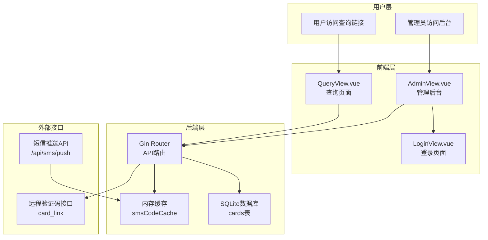
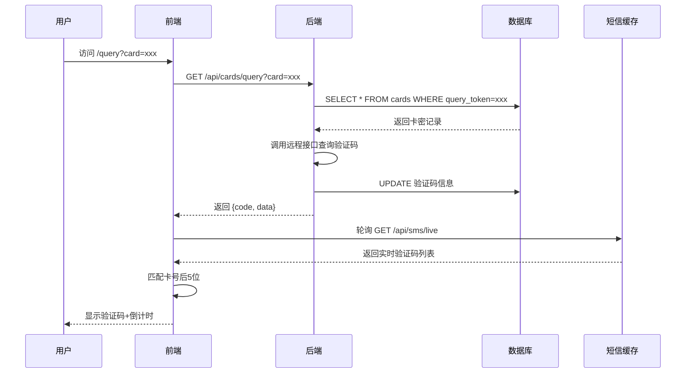
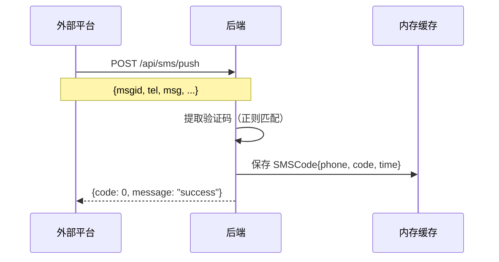

# 自动接收验证码系统 - 技术文档

## 一、项目架构树状图

```
auto_card/
├── 📁 backend/                    # 后端服务 (Go + Gin)
│   ├── main.go                    # 主入口、路由、业务逻辑
│   ├── go.mod                     # Go依赖管理
│   └── cards.db                   # SQLite数据库文件
│
├── 📁 frontend/                   # 前端应用 (Vue 3 + TypeScript)
│   ├── src/
│   │   ├── 📁 views/              # 页面视图
│   │   │   ├── QueryView.vue      # 查询页面（用户端）
│   │   │   ├── AdminView.vue      # 管理后台
│   │   │   └── LoginView.vue      # 登录页面
│   │   │
│   │   ├── 📁 components/         # 组件
│   │   │   ├── AdminTable.vue     # 卡密管理表格
│   │   │   ├── QueryCard.vue      # 查询卡片组件
│   │   │   └── Toast.vue          # 消息提示组件
│   │   │
│   │   ├── 📁 router/             # 路由配置
│   │   │   └── index.ts
│   │   │
│   │   ├── 📁 composables/        # 组合式函数
│   │   │   └── useToast.ts        # Toast消息逻辑
│   │   │
│   │   ├── App.vue                # 根组件
│   │   └── main.ts                # 前端入口
│   │
│   ├── dist/                      # 构建输出
│   └── package.json
│
├── 📁 mock_sms_api/               # 短信推送模拟接口
│   └── mock_sms_api.go
│
├── Dockerfile                     # Docker配置
├── railway.toml                   # Railway部署配置
└── README.md
```

---

## 二、系统架构流程图

### 2.1 整体架构图



### 2.2 验证码查询流程



### 2.3 短信推送流程



---

## 三、核心功能详解

### 3.1 数据库设计

```sql
-- cards 表结构
CREATE TABLE cards (
    id INTEGER PRIMARY KEY AUTOINCREMENT,
    card_no TEXT NOT NULL,              -- 卡号（手机号）
    card_link TEXT NOT NULL,            -- 远程查询接口
    phone TEXT,                         -- 手机号
    remark TEXT,                        -- 备注
    query_url TEXT,                     -- 本系统查询地址
    query_token TEXT,                   -- 查询令牌（卡号_随机后缀）
    created_at DATETIME,                -- 创建时间
    card_code TEXT,                     -- 验证码
    card_expired_date TEXT,             -- 过期时间
    card_note TEXT,                     -- 原始响应
    card_check BOOLEAN DEFAULT FALSE    -- 是否已查询
);
```

### 3.2 关键算法

#### 3.2.1 验证码提取算法
```go
// 从短信内容中提取验证码（6位数字）
func extractCodeFromSMS(msg string) string {
    patterns := []string{
        `验证码[是为:：\s]*([0-9]{4,8})`,
        `code[是为:：\s]*([0-9]{4,8})`,
        `([0-9]{4,8})[是为]?验证码`,
        `([0-9]{6})`, // 默认匹配6位数字
    }
    // ...
}
```

#### 3.2.2 卡号验证逻辑
```javascript
// 从 query_token 提取纯卡号
const cardMatchedCode = computed(() => {
  const token = cardParam.value || ''
  const pureCardNo = token.split('_')[0] || ''
  
  // 在实时验证码中查找匹配（后5位匹配）
  return codes.value.find(item => {
    const itemLast5 = item.phone.slice(-5)
    return itemLast5 === pureCardNo.slice(-5)
  })
})
```

---

## 四、API接口清单

| 接口 | 方法 | 描述 |
|------|------|------|
| /api/admin/login | POST | 管理员登录 |
| /api/admin/verify | GET | 验证登录状态 |
| /api/cards | GET | 获取卡密列表（分页） |
| /api/cards | POST | 批量添加卡密 |
| /api/cards/query | GET | 查询验证码 |
| /api/cards/live | GET | 获取实时验证码（面板） |
| /api/sms/push | POST | 接收短信推送 |
| /api/sms/live | GET | 获取实时短信列表 |
| /api/admin/batch-delete | DELETE | 批量删除 |
| /api/admin/export | POST | 批量导出 |

---

## 五、PPT讲解大纲

### 第1页：封面
- 标题：自动接收验证码系统
- 副标题：技术架构与实现详解
- 日期：2026年3月

### 第2页：项目背景
- 业务场景：腾讯视频会员自动接码
- 核心痛点：
  - 人工查询效率低
  - 验证码过期快
  - 多用户并发需求

### 第3页：系统架构
- 展示架构图
- 技术栈：
  - 后端：Go + Gin + SQLite
  - 前端：Vue 3 + TypeScript + Vite
  - 部署：Railway + Docker

### 第4页：核心功能流程
- 验证码查询流程图
- 短信推送流程图

### 第5页：数据库设计
- E-R图
- cards表结构详解
- 字段说明

### 第6页：前端实现
- 页面结构：
  - 查询页面（用户端）
  - 管理后台（管理员）
- 状态管理：Vue 3 Composition API
- 实时更新：轮询机制

### 第7页：后端实现
- 路由设计
- 业务逻辑分层
- 缓存策略：内存缓存 + 定时清理

### 第8页：安全设计
- 密码验证：admin123
- 查询令牌：卡号_随机后缀
- 防篡改：修改链接字母即失效

### 第9页：部署运维
- Railway平台部署
- Docker容器化
- 环境变量配置

### 第10页：总结与展望
- 已实现功能
- 待优化点：
  - WebSocket实时推送
  - 多租户支持
  - 数据统计分析

---

## 六、核心代码片段

### 6.1 后端主逻辑 (main.go)
```go
// 查询验证码并回写结果
func queryCard(c *gin.Context) {
    cardNo := c.Query("card")
    // 1. 查询数据库获取 card_link
    // 2. 请求远程接口
    // 3. 解析响应提取验证码
    // 4. 更新数据库
    // 5. 返回结果
}
```

### 6.2 前端查询组件 (QueryView.vue)
```vue
<template>
  <div class="query-page">
    <!-- 验证中 -->
    <!-- 手机号不存在 -->
    <!-- 显示验证码 -->
  </div>
</template>

<script setup>
// 1. 获取URL参数
// 2. 验证卡号是否存在
// 3. 轮询实时验证码
// 4. 倒计时计算
</script>
```

### 6.3 短信推送处理
```go
func receiveSMSPush(c *gin.Context) {
    // 1. 解析请求体
    // 2. 提取验证码
    // 3. 保存到内存缓存
    // 4. 清理过期数据
}
```

---

*文档生成时间：2026-03-15*
*版本：v2.0*
